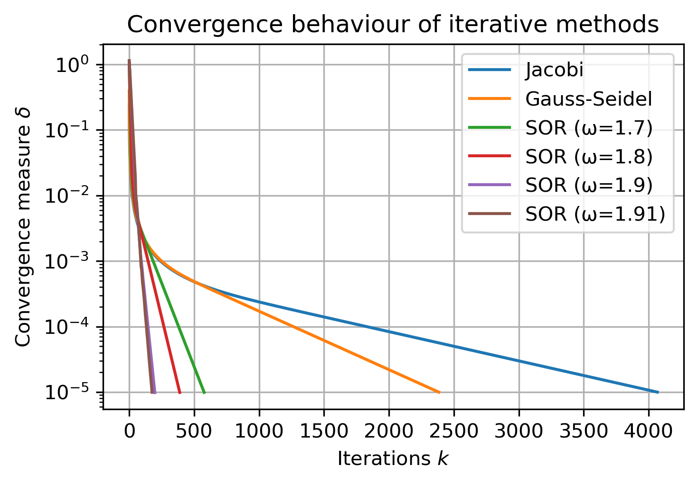

# Scientific Computing Exercises

Exercises for submission to Scientific Computing class at UvA (MSc Computational Science). 

## Exercise Set 1

1. 1D wave equation
2. 2D time-dependent diffusion equation
3. 2D Time-independent (Laplace) diffusion equation using
    - Jacobi iteration
    - Gauss-Seidel iteration
    - Successive Over Relaxation (SOR)

### Some visual results

#### Wave equation

    
    

#### Diffusion equation

    
    

#### Laplace solvers

    
    

## Exercise Set 2
1. Diffusion Limited Aggregation (DLA) using
    - SOR
    - Agent-based Monte-Carlo (Random Walkers)
2. Gray-Scott model (reaction-diffusion system)

### Some visual results

  

    
    
SOR (Laplace) solution after 500 iterations

  

  

    
    
MC (Random Walker) solution to size 450

  

## Exercise Set 3
1. Numerical solutions to Eigenmodes of drums or membranes (wave equation on 2D elastic material)
2. Solving steady state of diffusion equations
3. Applying the Leapfrog method - efficient time integration