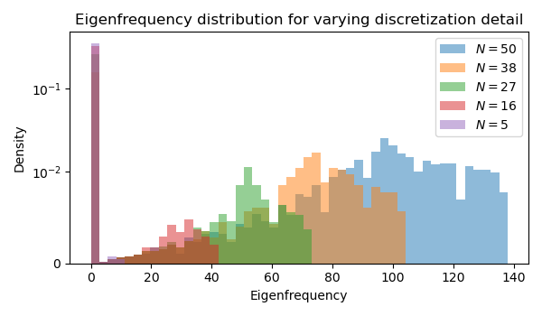
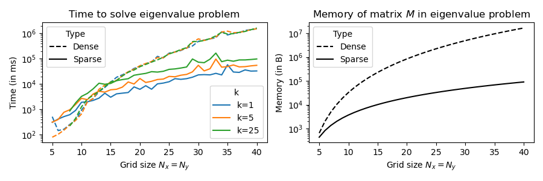

# Scientific Computing Exercises

Exercises for submission to Scientific Computing class at UvA (MSc Computational Science). 

## Exercise Set 1 visual results

#### Wave equation

    
    

#### Diffusion equation

    
    

#### Laplace solvers

    
    

## Exercise Set 2 visual results

#### Diffusion Limited Aggregation (DLA) - Laplace vs Random Walkers

    
    

#### Numerical scheme analysis

    
    

#### Reaction-Diffusion system (Gray-Scott)

    
    

## Exercise Set 3

#### Eigenmodes of drums (2D elastic membranes)

    
    

#### Further analysis

    
    

